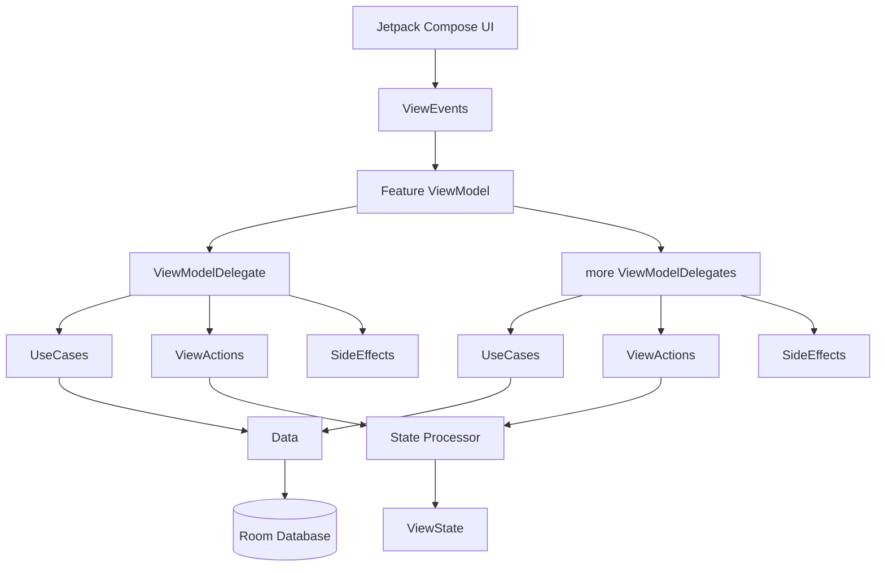

# Thoughts – Modern MVI Android App (MVP Diary App)

**Thoughts** is a modular, production-ready Android application demonstrating how to build a **scalable app** using **MVI architecture**, **Jetpack Compose**, and modern Android best practices.  
It’s structured for long-term maintainability, testability, and feature growth.

---

## ✨ Features

- **MVI architecture** with unidirectional data flow
- **Jetpack Compose** for all UI
- **Compose Navigation** (single source of truth for routes)
- **Koin** for dependency injection
- **Room** database with `Flow` support
- **Kotlin Coroutines** for concurrency
- **Ktor** + **Ktorfit** for type-safe HTTP APIs
- **Coil** for image loading in Compose
- **JUnit 5**, **Kluent**, and **Mockito-Kotlin** for deterministic unit and Flow tests
- Fully **modularized**: core, feature, and base layers

---

## 🗂 Module Overview

| Module                       | Responsibility                                                                     |
|------------------------------|------------------------------------------------------------------------------------|
| `app`                        | Application entry point, navigation host                                           |
| `base`                       | Shared helpers, configuration, and base interfaces                                 |
| `core_app`                   | Domain logic, Room database (DAO + entities)                                       |
| `core_models`                | Shared domain models                                                               |
| `core_navigation`            | Navigation contracts & routes (e.g., NavRoute)                                     |
| `core_ui`                    | Design system, Compose components, theming, and Coil-powered image helper          |
| `core_network`               | Ktor client configuration                                                          |
| `core_apod_api`              | Ktorfit API interfaces + Ktor DTOs/mappers for NASA APOD microservice              |
| `core_test`                  | Shared test utilities (JUnit 5, coroutines test, MockWebServer, Koin test helpers) |
| `feature_base`               | Base contracts for MVI ViewModels & effects                                        |
| `feature_day_screen`         | Shows daily thoughts                                                               |
| `feature_overview_screen`    | Displays thoughts overview + adding thoughts                                       |
| `feature_thought_viewer`     | Detail view for a single thought + editing/deleting thoughts                       |
| `feature_perspective_screen` | APOD-driven perspective screen, uses core_apod_api (Ktor/Ktorfit) + core_ui (Coil) |

---

## 🏗 Architecture

- **ViewEvent** → **ViewAction** → **StateProcessor** → **ViewState**
- Internal **ViewEvents** for communication between ViewModelDelegates
- **ViewEffect** for one-time events like navigation or snackbars

---

## 🛠 Tech Stack

- **Language**: Kotlin (K2 compiler)
- **UI**: Jetpack Compose + Material 3
- **Architecture**: MVI + Clean Architecture
- **Navigation**: Jetpack Navigation Compose
- **DI**: Koin
- **Database**: Room (Flow-based)
- **Concurrency**: Coroutines
- **Networking**: Ktor client + Ktorfit (KSP)
- **Images**: Coil (Compose)
- **Testing**: JUnit 5, Mockito-Kotlin, Kluent (assertions), MockWebServer
- **Gradle**: Version Catalogs (libs.versions.toml) and convention plugins (build-logic)

---

## 🔌 Networking

- core_network centralizes the Ktor HttpClient setup (engine, JSON serialization via kotlinx.serialization, logging, timeouts)
- core_apod_api defines Ktorfit interfaces for the NASA APOD endpoints and wires them into Koin
- core_app consumes core_apod_api through the ApodRepository and exposes use cases like GetApodUseCase

---

## 🖼 Images with Coil (Compose)

core_ui exposes an AppNetworkImageWithShimmer helper and theme-aware components. You can also use AsyncImage directly

---

## 🔐 Secrets & API keys

This project uses the Secrets Gradle Plugin for Android:
1. secrets.properties file in the project root (excluded from VCS!)
2. secrets.defaults.properties holding the public DEMO_KEY
3. core_network exposes BuildConfig.NASA_BASE_URL (default: https://api.nasa.gov/).

---